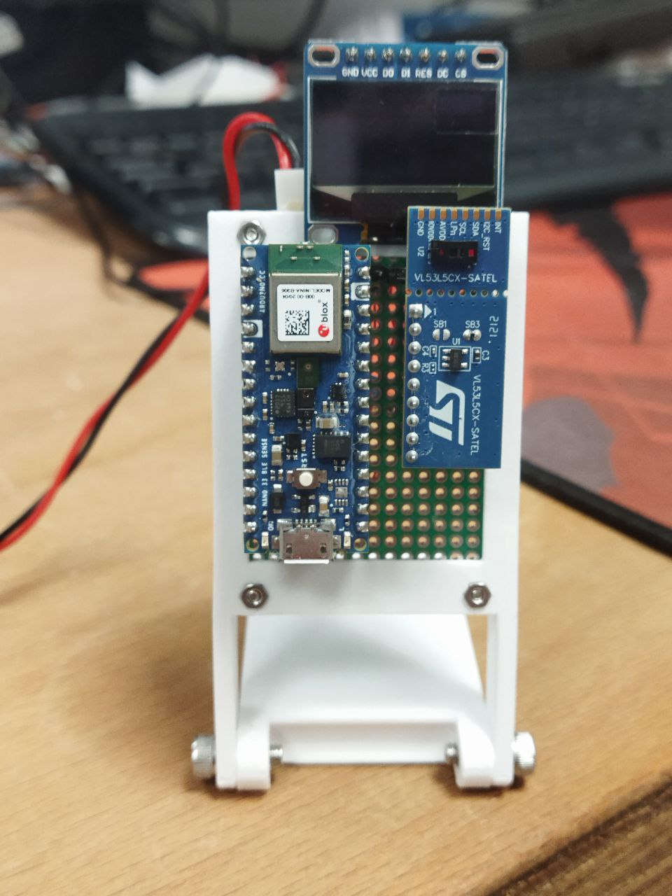
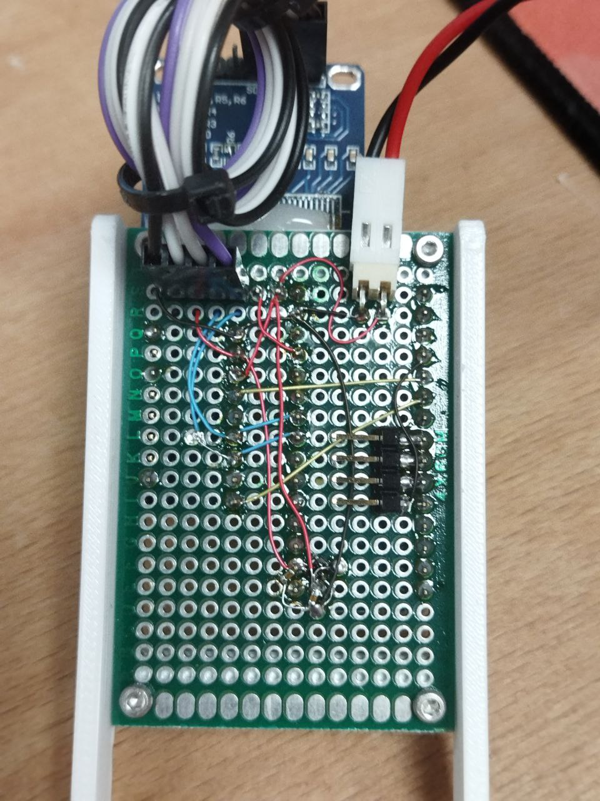
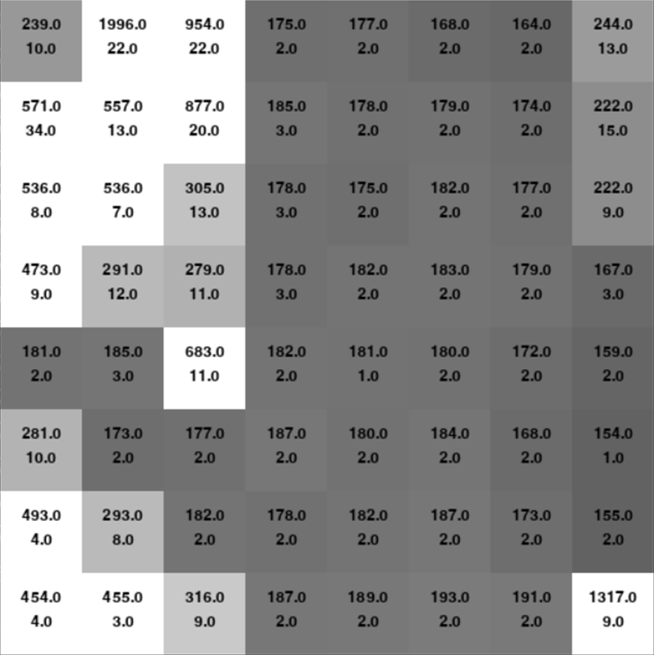
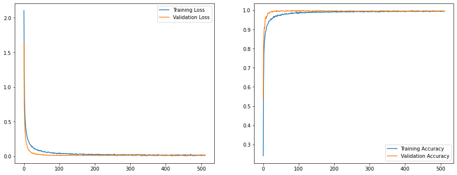
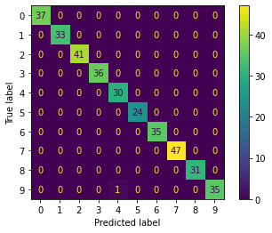
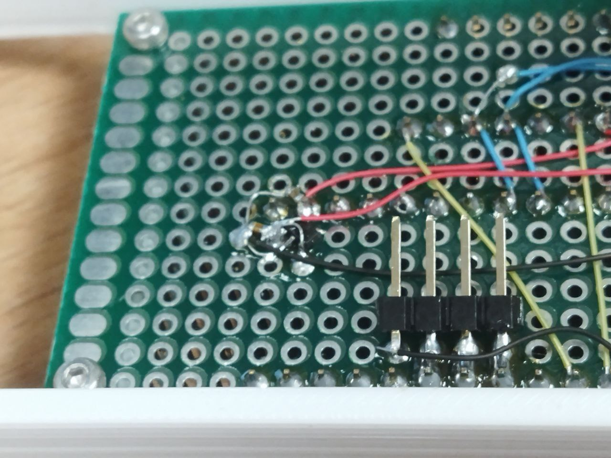
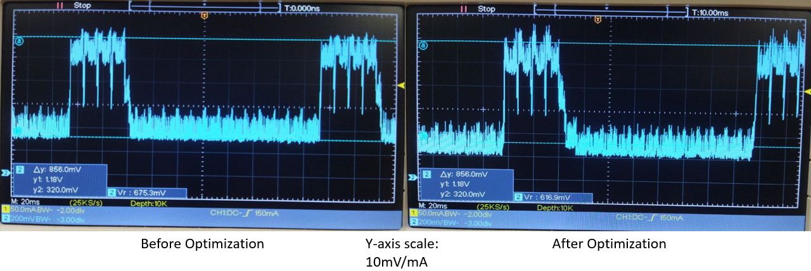

Features of the application
Model Training approach
Inference performance evaluation
Any optimization techniques used

# Gesture-Controlled Stopwatch

This discusses a gesture-controlled stopwatch, which allows time to be set with hand sign digits, then started by covering the sensor.

https://user-images.githubusercontent.com/9336475/162354235-2fe77fd1-f368-4b10-96f7-b48f7f26dbe2.mp4

# Background

 Final Implementation

This project relies on the [VL53L5CX](https://www.st.com/en/imaging-and-photonics-solutions/vl53l5cx.html), which is a multizone Time-of-Flight ranging sensor that outputs 4x4 or 8x8 depth maps of the sensor's view. It is useful to note here that since the sensor has a 63 degree field of view, the resolution of the depth map is dependent on the distance of the target to the sensor. TinyML is used in this case to interpret hand sign digits of zero to nine based on a 8x8 depth map from the VL53L5CX.

   
  Example of output data from VL53L5CX. Top Number: Distance, Bottom Number: Sigma

# Training the CNN

Training data was collected by streaming the depth map frames to a computer and recording the frames when sample hand sign digits were shown to the sensor. Data augmentation was explored to modify the distances with translations in all 3 axis.

Two types of output data from the sensor was used: distance to a target, and a sigma estimate of the noise in the reported distance. The data is first clipped and normalised, then formatted as an 8x8x2 input to a convolutional neural network, which then classifies into the ten hand sign digits.

[Quantization Aware Training](https://blog.tensorflow.org/2020/04/quantization-aware-training-with-tensorflow-model-optimization-toolkit.html) was used during the training of the model, which resulted in almost perfect accuracy on the test dataset.

# Power Optimization

## Regulator
[Multiple](https://support.arduino.cc/hc/en-us/articles/4402394378770-How-to-reduce-power-consumption-on-the-Nano-33-BLE) [sources](https://forum.arduino.cc/t/nano33-ble-how-should-i-go-about-reducing-current-draw/637270/2) suggests that replacing the MPM3610 on the Nano 33 BLE will reduce the quiescent current, which was empirically verified. A `LP2985-33DBVR` was instead used to step down 5V to 3.3V for the NRF52, reducing quiescent current consumption by approximately 8mA.

   
  LP2985-33DBVR mounted on perfboard

## Software
Additionally, some [software optimizations](https://github.com/JustinOng/gesture-controlled-stopwatch/commit/fa442ebda67f260477e725d4416183c4225f5623) were applied:
- Disabling unused peripherals like USB, UART, SPI, and hardware components like the LED indicators
- Using interrupts to signal data ready from the VL53L5CX, otherwise entering a reduced-power mode by calling `delay`
- [Limiting the amount of data transferred over I2C](https://github.com/JustinOng/gesture-controlled-stopwatch/commit/39eba069111d3005afbcf194ed179ac1f01e4806), reducing the total transaction time

Applying the software optimizations allowed us to save a few mA of quiescent current consumption, though a large contributor to power consumption is the VL53L5CX when it is actively ranging.

One possible optimization to address this issue is to limit the frame rate and integration time (time where the emitter is active, see the large spike in the graphs below) of the VL53L5CX when idle, then when a target is seen, scale up the frame rate (for faster response) and integration time (for more accurate frames).

  
  Current consumption measured across a 10R resistor. Note that in both these graphs, the aforementioned disabling of the on-board SMPS and replacing with a LDO has already been done.

